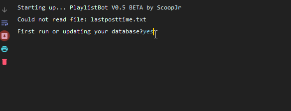

# Playlistbot
A bot that grabs youtube urls from /r/musicforpeople and plays them for you.  Simply input a range of songs(5->200) and it will play those songs.

## Driver Guide
For users wanting to use this script with Chrome, [chromedriver.exe](https://chromedriver.chromium.org/)

For users wanting to use this script with Firefox, [geckodriver.exe](https://github.com/mozilla/geckodriver/releases)

For users wanting to use this script with Internet Explorer, [IEDriverServer.exe](https://selenium.dev/downloads/)

### Simple Usage Guide
1. Go to executable folder 
2. Place your driver from the Driver Guide into the executable/webdriver folder.
3. Run playlistbot.exe

#### Script FAQ Guide
1. How to skip songs?
Type yeah when the bot asks if you want to skip!

2. I've selected songs and want to start a new selection, how do I do that?

Type stop when the bot asks if you want to skip or stop.  If will ask you to select a new set of songs.

3. How do I only play one song?

When it asks for an ending track number, press enter.
